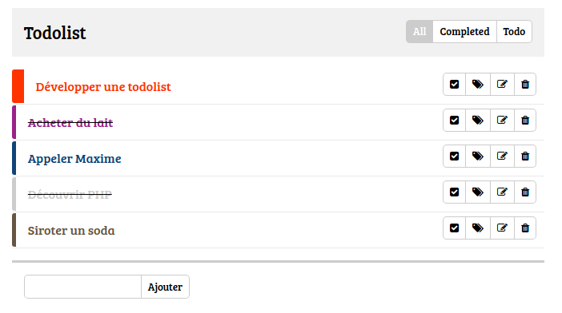

# To-do List avec PHP

## Objectif

L'objectif est de créer une application de to-do list.

Nous allons utiliser PHP afin de **séparer les données** de l'intégration HTML / CSS.
Concrètement, le contenu de la liste doit être stocké dans une variable PHP.
Cette variable est ensuite utilisée dans les templates pour générer le HTML de la liste.

Le but de la journée, c'est de faire de l'affichage :
* Réaliser l'intégration HTML / CSS
* Permettre au clic de faire le tri avec PHP, via un paramètre `$_GET`
  + `All` : afficher toutes les tâches
  + `Completed` : afficher uniquement les tâches complétées
  + `Todo` : afficher uniquement les tâches non complétées

Dans les prochaines journées, on se chargera d'ajouter des fonctionnalités pour
ajouter, modifier, supprimer les items de notre liste. On ajoutera également
une couche de JavaScript par la suite.

## Résultat

## Charte

* **Font**  
Bree Serif

* **Icones**  
Font Awesome

* **Couleurs**
  + `#f1f1f1`
  + `#eaeaea`
  + `#ccc`
  + `#f30`
  + `#147`
  + `#928`
  + `#654`

## Conseils

Vous avez toute la journée pour réaliser ce challenge, prenez donc le temps de faire les choses bien :
* Un code commenté et aeré.
* Une intégration aussi fidèle que possible.
* Pas tout dans un même fichier ! Pensez aux `include`.
* Des commentaires et des noms de variables descriptifs.
* Si possible, des commentaires et des noms de variables **en anglais**.
* Collaborer, ce n'est pas de la triche !
